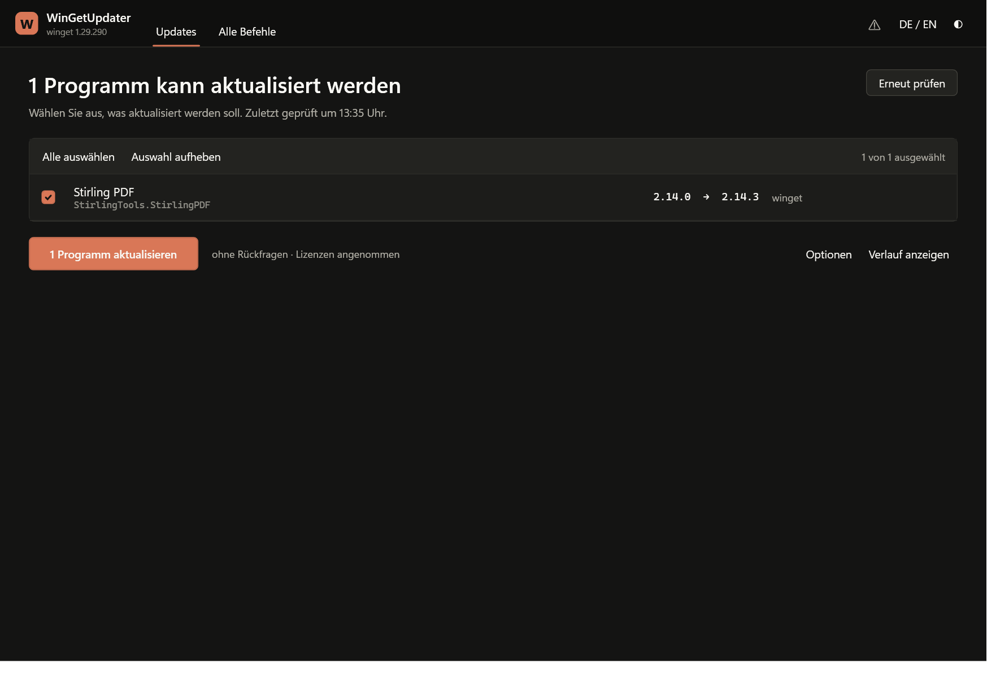
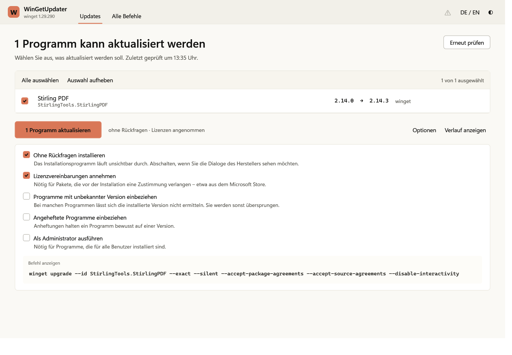
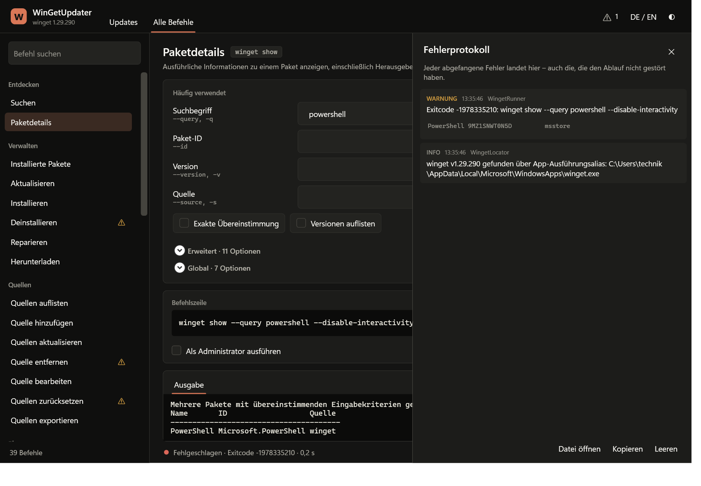
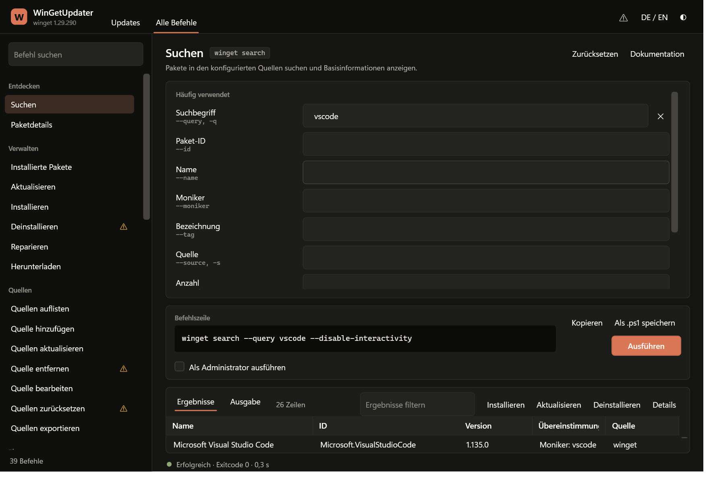

# WinGetUpdater

Eine Windows-Anwendung für den Paketmanager `winget`. Sie kann auf den ersten Blick genau eine
Sache — **installierte Programme aktualisieren** — und auf den zweiten alles, was `winget` kann.



Beim Start prüft die Anwendung von selbst, wofür es neuere Versionen gibt. Was man tun muss:
Haken setzen, auf den Knopf drücken. Kein Menü, keine Kommandozeile, keine Vorkenntnisse.

Wer mehr braucht, wechselt oben auf **Alle Befehle** und bekommt die vollständige
winget-Oberfläche: **39 ausführbare Befehle mit 99 Optionen**, jede einzelne als Bedienelement.
Das ist nicht behauptet, sondern geprüft — siehe [Vollständigkeit](#vollständigkeit).

---

## Die Hauptansicht

| | |
|---|---|
| **Beim Öffnen** | Die Prüfung läuft sofort los. Man sieht entweder eine Liste oder „Alles ist aktuell". |
| **Die Liste** | Programmname, Paket-ID, alte → neue Version, Quelle. Alles vorausgewählt, einzeln abwählbar. |
| **Der Knopf** | Beschriftet mit dem, was er tut: „3 Programme aktualisieren". Nicht „OK". |
| **Während des Laufs** | Jede Zeile bekommt ihren eigenen Zustand: läuft, aktualisiert, fehlgeschlagen. |
| **Wenn etwas schiefgeht** | Ein roter Kasten benennt das Programm und den Exitcode. Nichts verschwindet stillschweigend. |

Neben dem Knopf steht in Klartext, was gerade gilt — „ohne Rückfragen · Lizenzen angenommen".
Wer das ändern will, klappt **Optionen** auf. Dort steht zu jedem Schalter ein Satz, was er
bewirkt, und ganz unten die fertige Befehlszeile, die tatsächlich ausgeführt wird.



### Bewusste Festlegungen

| Entscheidung | Begründung |
|---|---|
| Die Prüfung startet ohne Zutun | Wer eine Update-Anwendung öffnet, will wissen, ob etwas ansteht — und nicht erst einen Knopf suchen. |
| Aktualisiert wird Programm für Programm | Ein Fehlschlag betrifft dann nur eine Zeile, und man sieht genau welche. `winget upgrade --all` würde alles in einen Topf werfen. |
| „Ohne Rückfragen" und „Lizenzen annehmen" sind vorausgewählt | Ohne sie bleibt ein unsichtbarer Vorgang an einer Abfrage hängen, die niemand sehen kann. Beide stehen sichtbar neben dem Knopf und lassen sich abschalten. |
| `--force` wird nie automatisch gesetzt | Es hebelt Prüfungen aus, die winget bewusst vornimmt. Es steht nur unter „Alle Befehle" zur Verfügung. |
| Es wird immer die Langform erzeugt (`--source`, nie `-s`) | winget belegt Kurzformen doppelt: `-h` ist bei `install` „silent", bei `configure` „history". |

---

## Fehler verschwinden nicht

Die Anwendung hat **keinen einzigen leeren `catch`-Block**. Jeder abgefangene Fehler landet im
Protokoll — auch die harmlosen, die den Ablauf nicht gestört haben. Die Anzeige in der Kopfzeile
zeigt jederzeit, ob etwas vorgefallen ist.



* **Im Fenster**: jeder winget-Aufruf mit Befehlszeile, Exitcode und Laufzeit; jede Ausgabe auf
  dem Fehlerkanal; jede abgefangene Ausnahme mit vollständigem Stapel.
* **In der Datei**: `%LOCALAPPDATA%\WinGetUpdater\wingetupdater.log`, fortlaufend geschrieben und
  bei 1 MB einmal umgewälzt. Übersteht auch einen Absturz.
* **Abgesichert**: der Test `NoSwallowedErrorsTests` durchsucht den Quelltext nach leeren oder
  nur kommentierten `catch`-Blöcken und lässt den Build scheitern, sobald einer auftaucht.
  Einzige Ausnahme ist der Logger selbst — scheitert das Schreiben der Datei, kann er sich nicht
  bei sich selbst beschweren.

Auch die Startfehler sind abgedeckt: lässt sich die Oberfläche nicht aufbauen, erscheint statt
eines leeren Fensters der Fehlertext samt Pfad zur Protokolldatei.

---

## Alle Befehle



Die vollständige Oberfläche, unverändert: alle 39 Befehle in acht Gruppen, alle 99 Optionen als
Bedienelement, gruppiert in *Häufig verwendet*, *Erweitert* und *Global*. Über dem Ausführen-Knopf
steht immer die exakte Befehlszeile — man sieht vor jedem Klick, was passiert, kann sie kopieren
oder als `.ps1` speichern. Ergebnisse von `search`, `list`, `upgrade`, `pin list` und
`source list` erscheinen als sortier- und filterbare Tabelle mit Mehrfachauswahl.

---

## Bauen und starten

Voraussetzung: .NET 10 SDK. Getestet mit 10.0.400 unter Windows 11.

```powershell
.\build.ps1
```

Das prüft das Schema gegen die installierte winget-Version, führt die Tests aus und legt eine
eigenständige Einzeldatei ab:

```
dist\win-x64\WinGetUpdater.exe    (~59 MB, läuft ohne installiertes .NET)
```

Für ARM-Geräte: `.\build.ps1 -Runtime win-arm64`.
Während der Entwicklung genügt `dotnet run --project src\WinGetUpdater`.

### Verborgene Schalter

Eine Anwendung ohne Konsole lässt sich sonst nur durch Hinsehen prüfen. Diese drei Schalter
machen sie automatisiert nachvollziehbar:

| Aufruf | Zweck |
|---|---|
| `--selftest` | Prüft Schema, Befehlsaufbau, Rechteerkennung und Tabellenparser ohne Fenster. Exitcode 0 = in Ordnung. |
| `--screenshot bild.png [--command <id>] [--query <text>] [--run] [--options] [--output] [--log] [--light] [--english]` | Nimmt das Fenster als PNG auf, wahlweise nach einem echten Lauf. `--screenshot none` überspringt das Bild. |
| `--report datei.tsv --command <id> --run --screenshot none` | Hängt Befehl, Zustand, Exitcode und Zeilenzahl an eine Datei — für Durchläufe über viele Befehle. |

Nicht behandelte Ausnahmen stehen zusätzlich in `%TEMP%\wingetupdater-crash.log`.

---

## Vollständigkeit

Der Anspruch „unterstützt alle Optionen" ist nur so viel wert wie seine Prüfung.

```powershell
.\tools\Check-Schema.ps1
```

Das Skript ruft für **jeden** der 39 Befehle `winget <befehl> --help` auf, liest per Regex jede
dort dokumentierte Option aus und vergleicht sie mit dem Schema. Es meldet drei Arten von
Abweichung: `FEHLT-IM-SCHEMA`, `NICHT-IN-WINGET` und `UNBENUTZTE-OPTION`. Exitcode 0 bedeutet
deckungsgleich; `build.ps1` bricht ab, wenn das Skript rot ist.

**Bei einer neuen winget-Version** genügt es, das Skript laufen zu lassen und die gemeldeten
Optionen in `src\WinGetUpdater\Resources\winget-schema.json` nachzutragen. Die Oberfläche ändert
sich dabei nicht — sie wird vollständig aus dem Schema erzeugt. Wer nicht neu bauen will, legt
eine angepasste `winget-schema.json` in einen Ordner `Resources` neben die EXE; eine solche Datei
hat Vorrang vor der eingebetteten.

---

## Aufbau

```
src\WinGetUpdater\
├─ Resources\winget-schema.json   Alle 39 Befehle und 99 Optionen, zweisprachig beschrieben
├─ Models\Schema.cs               Datentypen dazu
├─ Services\
│  ├─ SchemaStore.cs              Lädt das Schema (eingebettet oder extern)
│  ├─ WingetLocator.cs            Findet winget.exe, auch außerhalb des PATH
│  ├─ CommandLineBuilder.cs       Baut Argumente und die Vorschauzeile
│  ├─ WingetRunner.cs             Führt aus, streamt die Ausgabe, protokolliert jeden Lauf
│  ├─ TableParser.cs              Liest die Spaltentabellen sprachunabhängig
│  ├─ ElevationService.cs         Entscheidet und begründet die Rechteerhöhung
│  ├─ ErrorLog.cs                 Sammelstelle für alles, was schiefgeht
│  └─ Localizer.cs                Texte der Oberfläche in DE und EN
├─ ViewModels\                    ShellVm (zwei Betriebsarten), UpdateVm, CommandVm, OptionVm
└─ Views\                         ShellWindow, UpdatePage, CommandPage, Konverter
tools\Check-Schema.ps1            Der Vollständigkeitsnachweis
tests\WinGetUpdater.Tests\         63 Tests, davon 5 gegen unveränderte winget-Ausgaben
```

Kein einziges NuGet-Paket in der Anwendung selbst — WPF, `System.Text.Json` und `Process`
reichen. Das Projekt baut damit auch offline und ohne installierte Workloads.

Die Hauptansicht ist keine Abkürzung mit eigenen Regeln: `UpdateVm` erzeugt seine Befehlszeilen
über denselben `CommandLineBuilder` wie die vollständige Oberfläche und ist damit an dasselbe
Schema gebunden.

### Der Tabellenparser, und warum er so aussieht

winget gibt seine Tabellen als Text aus. Drei Eigenheiten mussten dabei einzeln behandelt werden,
alle drei durch echte Ausgaben dieses Rechners aufgedeckt:

1. **Die Spaltenköpfe sind lokalisiert** — „Übereinstimmung" statt „Match". Die Spaltengrenzen
   werden deshalb aus Positionen bestimmt, nicht aus Namen.
2. **winget füllt nach Darstellungsbreite, nicht nach Zeichenanzahl.** Ein installiertes Paket
   mit einem ostasiatischen Zeichen im Namen belegt zwei Spalten, aber nur ein `char` — wer in
   Zeichen rechnet, liest diese Zeile um eine Stelle verschoben, und die Paket-ID beginnt mitten
   im Namen. Der Parser rechnet in Darstellungsspalten.
3. **`winget upgrade` hängt seine Zusammenfassung ohne Leerzeile an die Tabelle** und schreibt bei
   engen Spalten `Version Verfügbar Quelle` mit je einem Leerzeichen. Ein einzelnes Leerzeichen
   gilt deshalb zusätzlich als Spaltengrenze, wenn an derselben Stelle in jeder Datenzeile
   ebenfalls eines steht; Zeilen, die das Raster verletzen, landen im Anhang statt in der Tabelle.

Die Testdateien unter `tests\WinGetUpdater.Tests\Fixtures\` sind unveränderte Originalausgaben.

### Die Farbwelt

Die Palette folgt den Anthropic-Markenrichtlinien: Dark `#141413`, Cream `#faf9f5`,
Mid Gray `#b0aea5`, Light Gray `#e8e6dc`, dazu Orange `#d97757` als Akzent sowie Blau und Grün.
Drei Festlegungen ergeben sich daraus:

* **Auf Orange steht dunkler Text, nicht weißer.** `#141413` auf `#d97757` erreicht 5,9:1,
  Weiß nur 3,1:1 und fällt damit unter die Lesbarkeitsschwelle. Deshalb ist `Fg.OnAccent` in
  beiden Designs dunkel.
* **Orange ist die Aktionsfarbe und kann nicht zugleich Fehler bedeuten.** Fehler bekommen ein
  eigenes Rot, Warnungen ein Gold — und jeder Zustand trägt zusätzlich sein eigenes Zeichen
  (✓ / ✕ / ●) und einen Text. Rot und Orange sind das klassische Verwechslungspaar bei
  Farbfehlsichtigkeit; die Bedeutung hängt deshalb nie an der Farbe allein.
* **Jede verwendete Vordergrund-/Hintergrundpaarung erreicht mindestens 4,5:1.** Nachgemessen,
  nicht geschätzt.

Die Schriften der Marke (Poppins, Lora) sind bewusst *nicht* übernommen: sie sind auf dem
Zielsystem nicht installiert, und WPF kann keine Webschriften nachladen — die Oberfläche würde
still auf Arial und Georgia zurückfallen. Es bleibt bei Segoe UI.

### Die Rechteerhöhung

Ein per `runas` gestarteter Prozess lässt sich nicht umleiten. Der erhöhte Aufruf schreibt daher
in eine Protokolldatei, die während des Laufs mitgelesen wird. Für die Oberfläche sieht das aus
wie jeder andere Lauf.

---

## Was nicht enthalten ist

Geplante Erweiterung: ein Zeitplan für unbeaufsichtigte Updates über die Windows-Aufgabenplanung,
mit Allow- und Blocklist.

Für genau diese Aufgabe gibt es bereits
[Winget-AutoUpdate](https://github.com/Romanitho/Winget-AutoUpdate) (MIT) von Romanitho — ein
PowerShell-Dienst, der Updates im SYSTEM-Kontext fährt. Übernommen ist daraus bisher **ein**
Konzept, in C# neu geschrieben: das Auffinden von `winget.exe` außerhalb des PATH
(`Get-WingetCmd.ps1` → `WingetLocator.cs`). Drei weitere sind vorgemerkt, aber **noch nicht
umgesetzt**: Prüfung auf ausstehende Neustarts, Erkennung getakteter Verbindungen und das
Allow-/Blocklist-Modell.

Als Frontend ist außerdem [UniGetUI](https://github.com/Devolutions/UniGetUI) verbreitet. Es deckt
acht Paketmanager ab und verfolgt damit das entgegengesetzte Ziel: kleinster gemeinsamer Nenner
statt vollständige Tiefe. Konkret ruft es 9 der 39 winget-Befehle auf und erzeugt bei `install`
14 der 41 Optionen; der Rest ist dort nur über ein Freitextfeld erreichbar.

---

## Bekannte Grenzen

* **Der erhöhte Ausführungspfad ist nicht durch Tests abgedeckt** — er verlangt eine echte
  UAC-Bestätigung. Ein maschinenweites Update ist der erste Fall, an dem er sich zeigt.
* Die Meldungen im Fehlerprotokoll sind immer auf Deutsch, auch bei englischer Oberfläche. Sie
  sind Diagnosetext für die Fehlersuche, keine Bedienoberfläche.
* Die Ausgabe von winget erscheint in der Sprache von Windows, unabhängig von der eingestellten
  Oberflächensprache. Das ist winget-Verhalten und nicht änderbar.
* Sehr lange Werte kann winget in seinen Tabellen mit `…` kürzen. Die Rohausgabe unter
  „Alle Befehle → Ausgabe" zeigt sie vollständig.
* `dscv3` erwartet seine Eingabe über die Standardeingabe. Die Oberfläche stellt die Schalter
  bereit, reicht aber noch keine Nutzlast durch.

---

## Lizenz

[MIT](LICENSE) — © 2026 Stefan Dohr.

Das Auffinden von `winget.exe` außerhalb des PATH ist konzeptionell
[Winget-AutoUpdate](https://github.com/Romanitho/Winget-AutoUpdate) entlehnt (MIT, © Romanitho);
der Code ist eigenständig in C# geschrieben.
